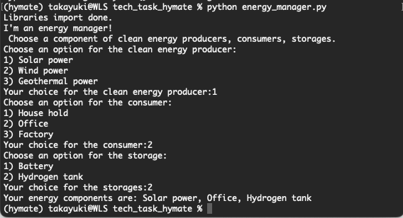

# hymate-techtask

## Create a conda env
`conda env create --file environment.yaml`

# 1. API call with AWS cloud
## Task
The task below is to be performed in a serverless mindset. Everything can and has to be done using AWS Cloud resources. The resources itself don’t have to be implemented on AWS, but the code has to be written as if it was. The candidate must indicate what services are needed in each step and explain why the chosen service is the best choice. The code has to be usable in the pointed services without changes.

Using an Open-Meteo API method, design a code that is capable of making requests on a fixed interval, and saving the responses. The request has to get 3 days of hourly forecast every day starting from two days before (today-2), and store the data for later fast access and usage. You may perform any data transformations you see fit, provided you explain the reason.
The API documentation can be found at: https://open-meteo.com/

Information required: Temperature, Relative humidity, Rain, Snowfall, Snow Depth, Cloudcover, Direct Solar Radiation, Diffuse Solar Radiation

## Solution
To implement an API call in a server-less setup, I used AWS Lambda, Amazon S3 bucket, and EventBridge with cron.
lamda_function.py is deployed on AWL Lambda, which is connected to S3 bucket to store the response of Open-Meteo API calls in JSON format.
I assume that we need weather forecast data every morning. Therefore, I configured EventBridge with crom so that the lamda_function.py is executed at 8 am every day and the result is stored in S3 bucket with today's date as the file name e.g. 2023-08-29.json.
The resource is implemented in my AWS account and we can discuss more details when we meet.

## Usage
lambda_function.py can be directly deployed on AWS lambda. Just change BUCKET_NAME to your bucket name. An example of the response of the API call is saved as 2023-08-29.json

# 2. Energy Management System
## Task
The system must manage the energy flow of a generic household. Any generic household energy system has energy producers, consumers, storage solutions and access to the grid. The goal of every energy management system is to minimize the carbon emissions of electricity consumption and reduce costs by using clean energy.

Develop a system that can configure any combination of components. The possibilities must include, at least two types of clean energy producers, at least the household as a consumer and a battery as storage. The system has to enable modularity and expandability, meaning if I were to add more battery capacity, or a new clean energy producer, It could easily be done. Create one configured system as an example. The system should have at least one clean producer, one consumer, battery storage and grid access. Use the provided dataset for the households consumption and solar panels production. Feel free to generate profiles for other green energy producers.

Implement a method that will read through the dummy dataset given and decide how the electricity demand should be met. Create your own logic to decide when to use energy from the clean producers, the battery or the grid. Try to consider all scenarios, specified and non-specified, for example when to charge the battery. Log all the decisions made by your logic and save it also as a timeseries. The log should be the same length as the dummy dataset and register at each 5 minutes the energy flows between the components. Tip: One column for each component and how much energy is going in or out at each time step.

## Solution
To make an Energy Management System that consists of multiple components, I first made a class for CleanEnergyProducer, Consumer, and Storage. Then, I made instances based on each class e.g. solar_power instance for CleanEnergyProducer class. Next, I implemented choose_component function that lets a user choose a combination of the components by user inputs.

Below here is not tested and may not work properly. I would like to discuss how we could do it better.

I tried to create another class for the configured system, which is a child class of CleanEnergyProducer class, Consumer class and Storage class. However, I couldn't manage to inherit multiple classes properly, therefore, I made another independent class called ConfiguredSystem as an alternative. It has a method called decide_component to decide which component the system uses at the time based on the logic. It saves the decision of which component was used as a log in a column in a dummy dataset. The logic is rather simple as I don't have much knowledge of energy management yet. When the supply of clean energy is larger than demand, always use clean energy. Then, when there is still power left in storage, use storage. It always keeps a small amount in case of emergency. When neither clean energy nor storage is available, use legacy energy from the grid.

## Usage
`python energy_manager.py`
Then, you can choose a combination of the components as CLI inputs like below.

